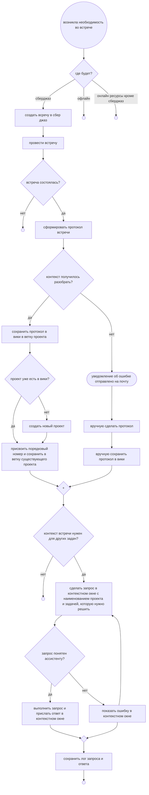

```mermaid
flowchart TD
    S(("возникла необходимость во встрече")) --> G1{"где будет?"}
    G1 -->|сберджаз| A1["создать всречу в сбер джаз"]
    G1 -->|офлайн| E1((" "))
    G1 -->|онлайн ресурсы кроме сберджаз| E2((" "))
    A1 --> A2["провести встречу"]
    A2 --> G2{"встреча состоялась?"}
    G2 -->|нет| E3((" "))
    G2 -->|да| A3["сформировать протокол встречи"]
    A3 --> G3{"контекст получилось разобрать?"}
    G3 -->|да| A4["сохранить протокол в вики в ветку проекта"]
    G3 -->|нет| M1(["уведомление об ошибке отправлено на почту"])
    M1 --> A5["вручную сделать протокол"]
    A5 --> A6["вручную сохранить протокол в вики"]
    A4 --> G4{"проект уже есть в вики?"}
    G4 -->|да| A7["присвоить порядковый номер и сохранить в ветку существующего проекта"]
    G4 -->|нет| A8["создать новый проект"]
    A8 --> A7
    A7 --> P1{"+"}
    A6 --> P1
    P1 --> G5{"контекст встречи нужен для других задач?"}
    G5 -->|нет| E4((" "))
    G5 -->|да| A9["сделать запрос в контекстном окне с наименованием проекта и задачей, которую нужно решить"]
    A9 --> G6{"запрос понятен ассистенту?"}
    G6 -->|да| A10["выполнить запрос и прислать ответ в контекстном окне"]
    G6 -->|нет| A11["показать ошибку в контекстном окне"]
    A11 --> A9
    A10 --> X1{" "}
    A11 --> X1
    X1 --> A12["сохранить лог запроса и ответа"]
    A12 --> E5((" "))
```
