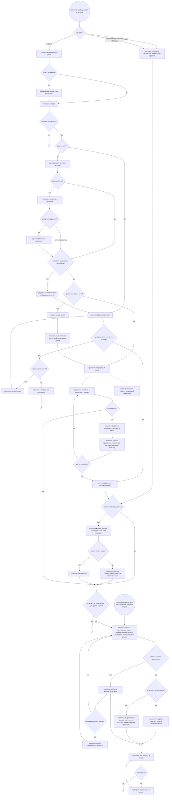

```mermaid
flowchart TD
    S(("возникла необходимость во встрече")) --> G1{"где будет?"}
    G1 -->|сберджаз| A1["создать всречу в сбер джаз"]
    G1 -->|офлайн| O1["вручную сохранить протокол в вики в папку проекта"]
    G1 -->|онлайн ресурсы кроме сберджаз| O1
    O1 --> V3
    A1 --> R1{"запись включена?"}
    R1 -->|да| A2["провести встречу"]
    R1 -->|нет| N1["напоминание «запись не включена»"]
    N1 --> A2
    A2 --> G2{"встреча состоялась?"}
    G2 -->|нет| E3((" "))
    G2 -->|да| R2{"запись есть?"}
    R2 -->|нет| A5
    R2 -->|да| A3["сформировать протокол встречи"]
    A3 --> R3{"запись полная?"}
    R3 -->|да| G3{"контекст получилось разобрать?"}
    R3 -->|нет| N2["пометка «неполная встреча»"]
    N2 --> D1{"дополнить вручную?"}
    D1 -->|да| A13["вручную дополнить протокол"]
    D1 -->|нет, оставить так| G3
    A13 --> G3
    G3 -->|да| G4{"проект уже есть в вики?"}
    G3 -->|нет| M1(["уведомление об ошибке отправлено на почту"])
    M1 --> A5["вручную сделать протокол"]
    A5 --> W1{"протокол готов в течение 3 суток?"}
    W1 -->|да| A6["вручную сохранить протокол в вики"]
    W1 -->|нет| C1{"напоминаний уже 5?"}
    C1 -->|нет| N3["повторное напоминание"]
    N3 --> A5
    C1 -->|да| N4["пометить «встреча без протокола»"]
    N4 --> E6((" "))
    A6 --> V3{"проект и номер указаны?"}
    V3 -->|да| P1
    V3 -->|нет| N7["предупреждение «проект не найден» или «нет номера»"]
    N7 --> D2{"проект есть в списке?"}
    D2 -->|да| S1["выбрать проект из списка, номер ставится автоматически"]
    D2 -->|нет| S2["создать новый проект"]
    S1 --> P1
    S2 --> P1
    A4 --> V1{"сохранилось?"}
    V1 -->|нет| N6["письмо «не удалось сохранить протокол в вики»"]
    N6 --> Q1["протокол ждёт во временном хранилище, система повторяет попытку"]
    Q1 --> V2{"доступ появился?"}
    V2 -->|да| A4
    V2 -->|нет| A6
    V1 -->|да| P1
    G4 -->|да| A7["присвоить порядковый номер"]
    G4 -->|нет| A8["создать новый проект"]
    A8 --> N5["пометить новый проект для ручной проверки на дубли"]
    N5 --> A7
    A7 -.- K11["если номер занят, берётся следующий свободный"]
    A7 --> A4["сохранить протокол в вики в ветку проекта"]
    P1{" "}
    P1 --> G5{"контекст встречи нужен для других задач?"}
    G5 -->|нет| E4((" "))
    ST2(("появилась задача, для которой нужен контекст встречи")) --> A9
    G5 -->|да| A9["сделать запрос в контекстном окне с наименованием проекта и задачей, которую нужно решить"]
    A9 --> G6{"запрос понятен ассистенту?"}
    G6 -->|да| G7{"ответ есть в протоколах?"}
    G7 -->|да| A10["выполнить запрос и прислать ответ в контекстном окне"]
    G7 -->|нет| N10["ответить «в протоколах проекта этого нет» и показать просмотренные протоколы"]
    G6 -->|нет| A11["показать ошибку в контекстном окне"]
    A11 --> C2{"несколько неудач подряд?"}
    C2 -->|нет| A9
    C2 -->|да| N9["показать шаблон правильного запроса"]
    N9 --> A9
    A10 --> X1{" "}
    N10 --> X1
    A11 --> X1
    X1 --> A12["сохранить лог запроса и ответа"]
    A12 --> L1{"лог записан?"}
    L1 -->|да| E5((" "))
    L1 -->|нет| N11["повторить запись лога в фоне"]
    N11 --> A12
```
